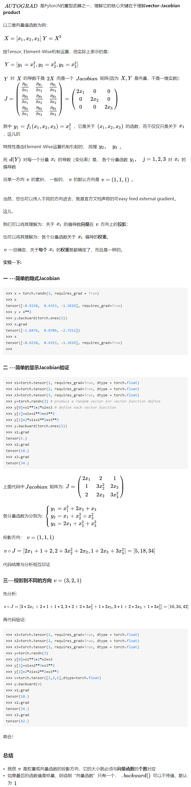

# Pytorch

## torch & lua

```
Torch: A Tensor library like Numpy, unlike Numpy it has strong GPU support. Lua is a wrapper for Torch
```

**Torch 是一个用于机器学习和科学计算的模块化开源库**。Torch 最初是 NYU 的研究人员为学术研究而开发的。**该库通过对 LuaJIT 编译器的利用提高了性能**，而且基于 `C` 的 NVIDIA CUDA 扩展使得 Torch 能够利用 GPU 加速。

**许多开发人员使用 Torch 作为受 GPU 支持的 NumPy 替代方案**；其他开发人员使用它来开发深度学习算法。

Lua 是一种支持多种编程模型的轻量型脚本语言；它源自于应用程序的可扩展性。Lua 非常紧凑，而且是用 `C` 编写的，这使它能够在资源受限的嵌入式平台上运行。巴西的 Pontifical Catholic University of Rio de Janeiro 于 1993 年首次介绍了 Lua。

LuaJIT 是一种即时 (JIT) 编译器，采用特定于平台的优化来提高 Lua 的性能。它还扩展并增强了标准 Lua 的 `C` 应用编程接口 (API)。

## Tensorflow vs Pytorch

**PyTorch更有利于研究人员、爱好者、小规模项目等快速搞出原型。而TensorFlow更适合大规模部署，特别是需要跨平台和嵌入式部署时。** 

创建和运行计算图可能是两个框架最不同的地方。在PyTorch中，图结构是动态的，这意味着图在运行时构建。而在TensorFlow中，图结构是静态的，这意味着图先被“编译”然后再运行。

举一个简单的例子，在PyTorch中你可以用标准的Python语法编写一个for循环结构

```
for _ in range(T):
    h = torch.matmul(W, h) + b
```

此处T可以在每次执行代码时改变。而TensorFlow中，这需要使用“控制流操作”来构建图，例如tf.while_loop。TensorFlow确实提供了dynamic_rnn用于常见结构，但是创建自定义动态计算真的更加困难。

PyTorch中简单的图结构更容易理解，更重要的是，还更容易调试。调试PyTorch代码就像调试Python代码一样。你可以使用pdb并在任何地方设置断点。调试TensorFlow代码可不容易。**要么得从会话请求要检查的变量，要么学会使用TensorFlow的调试器（tfdbg）。J这一点尤其认同，要检查一个量，必须运行下会话。**

## Pytorch

PyTorch是一个基于Torch的Python开源机器学习库，用于自然语言处理等应用程序。 它主要由Facebook的人工智能研究小组开发。Uber的"Pyro"也是使用的这个库。 

### 安装

pytorch的安装经过了几次变化，请大家以官网的安装命令为准。另外需要说明的就是在1.2版本以后，pytorch只支持cuda 9.2以上了，所以需要对cuda进行升级，目前测试大部分显卡都可以用，包括笔记本的MX250也是可以顺利升级到cuda 10.1。


直接在官网选中就会告诉安装命令：

```linux
conda install pytorch torchvision cpuonly -c pytorch
```

验证输入python 进入

```python
import torch
torch.__version__
# 得到结果'1.3.0'
```

### 快速入门

####张量：Tensors与Numpy中的 ndarrays类似

但是在PyTorch中 Tensors 可以使用GPU进行计算。

#####创建矩阵

```python
import torch
x = torch.empty(5, 3) #创建一个 5x3 矩阵, 但是未初始化

tensor([[0.0000, 0.0000, 0.0000],
        [0.0000, 0.0000, 0.0000],
        [0.0000, 0.0000, 0.0000],
        [0.0000, 0.0000, 0.0000],
        [0.0000, 0.0000, 0.0000]])

x = torch.rand(5, 3) #创建一个随机初始化的矩阵:

tensor([[0.6972, 0.0231, 0.3087],
        [0.2083, 0.6141, 0.6896],
        [0.7228, 0.9715, 0.5304],
        [0.7727, 0.1621, 0.9777],
        [0.6526, 0.6170, 0.2605]])

```
#####创建张量

```python
x = torch.tensor([5.5, 3]) #创建tensor并使用现有数据初始化:

tensor([5.5000, 3.0000])

print(x.size())

torch.Size([5, 3]) #也可用shape
```

##### 张量的操作

###### 加法（+或add）

```python
y = torch.rand(5, 3)
print(x + y)
print(torch.add(x, y))
result = torch.empty(5, 3)
torch.add(x, y, out=result) #提供输出tensor作为参数
print(result)
y.add_(x) #有替换效果
print(y) 
tensor([[ 0.7808, -1.4388,  0.3151],
        [-0.0076,  1.0716, -0.8465],
        [-0.8175,  0.3625, -0.2005],
        [ 0.2435,  0.8512,  0.7142],
        [ 1.4737, -0.8545,  2.4833]])
```

###### 索引（切片）

```python
print(x[:, 1]) #你可以使用与NumPy索引方式相同的操作来进行对张量的操作
tensor([-2.0126,  0.4692, -0.5764,  0.6688, -1.1600])
```

###### 变化维度

```python
x = torch.randn(4, 4)
y = x.view(16) #torch.view 与Numpy的reshape类似
z = x.view(-1, 8)  #  size -1 从其他维度推断
print(x.size(), y.size(), z.size())
torch.Size([4, 4]) torch.Size([16]) torch.Size([2, 8])
#如果你有只有一个元素的张量，使用.item()来得到Python数据类型的数值

x = torch.randn(1)
print(x)
print(x.item())
tensor([-0.2368])
-0.23680149018764496
```

###### Numpy Array转换

```python
#将一个Torch Tensor转换为NumPy数组
a = torch.ones(5)
print(a)
tensor([1., 1., 1., 1., 1.])
b = a.numpy()
print(b)
[1. 1. 1. 1. 1.]
#使用from_numpy自动转化
import numpy as np
a = np.ones(5)
b = torch.from_numpy(a)
np.add(a, 1, out=a)
print(a)
print(b)
[2. 2. 2. 2. 2.]
tensor([2., 2., 2., 2., 2.], dtype=torch.float64)
```

#### Autograd：自动求导机制

PyTorch 中所有神经网络的核心是 `autograd` 包。 

`autograd`包为张量上的所有操作提供了自动求导。 它是一个在运行时定义的框架，这意味着反向传播是根据你的代码来确定如何运行，并且每次迭代可以是不同的。

##### 关键概念

创建一个张量并设置 requires_grad=True 用来追踪他的计算历史。

`.requires_grad_( ... )` 可以改变现有张量的 `requires_grad`属性。 如果没有指定的话，默认输入的flag是 `False`。

##### 实例

```python
x = torch.rand(5, 5, requires_grad=True)
y = torch.rand(5, 5, requires_grad=True)
z= x**2+y**3
#我们的返回值不是一个标量，所以需要输入一个大小相同的张量作为参数，这里我们用ones_like函数根据x生成一个张量
z.backward(torch.ones_like(x))
print(x.grad)
```

```linux
tensor([[0.2087, 1.3554, 0.5560, 1.0009, 0.9931],
        [1.2655, 0.1223, 0.8008, 1.1127, 0.7261],
        [1.1052, 0.2579, 1.8006, 0.1544, 0.3646],
        [1.8855, 1.2296, 1.9061, 0.9313, 0.0648],
        [0.5952, 1.6190, 0.8430, 1.9213, 0.0322]])
```

我们可以使用with torch.no_grad()上下文管理器临时禁止对已设置requires_grad=True的张量进行自动求导。这个方法在测试集计算准确率的时候会经常用到，例如：

```python
with torch.no_grad():
    print((x +y*2).requires_grad) #result is Fasle
```

使用.no_grad()进行嵌套后，代码不会跟踪历史记录，也就是说保存的这部分记录会减少内存的使用量并且会加快少许的运算速度。

##### 过程解释

1. **当我们执行z.backward()的时候。这个操作将调用z里面的grad_fn这个属性，执行求导的操作。**
2. **这个操作将遍历grad_fn的next_functions，然后分别取出里面的Function（AccumulateGrad），执行求导操作。这部分是一个递归的过程直到最后类型为叶子节点。注：`grad_fn.next_functions`  本节点接收的上级节点的`grad_fn`** 
3. **计算出结果以后，将结果保存到他们对应的variable 这个变量所引用的对象（x和y）的 grad这个属性里面。**
4. **求导结束。所有的叶节点的grad变量都得到了相应的更新。**

##### 原理解释

1. 向量值函数，又称为向量函数。一元函数是一个由定义域到值域的映射，其定义域与值域都是一维数集．我们要研究的向量值函数是指分量都是关于同一自变量的一元函数。就是说n元向量值函数是$x$到$x^n$上的映射。**J输入是一个向量，而不是平时看到的标量。**
2. 下面有两个概念，Y对X的导数是jacobian矩阵，**而对其中某个$x_i$的导数，则是各个分量函数对这个$x_i$的偏导数（在jacobian矩阵中可以查到）沿某个v方向的累计（J所谓沿某个方向，在向量中就是乘积啦，见下面的投影到不同方向）。**




####神经网络

使用torch.nn包来构建神经网络。

`nn`包依赖`autograd`包来定义模型并求导。 **一个`nn.Module`包含各个层和一个`forward(input)`方法，该方法返回`output`。**

神经网络的典型训练过程如下：

1. 定义包含一些可学习的参数(或者叫权重)神经网络模型；
2. 在数据集上迭代；
3. 通过神经网络处理输入；
4. 计算损失(输出结果和正确值的差值大小)；
5. 将梯度反向传播回网络的参数；
6. 更新网络的参数，主要使用如下简单的更新原则： `weight = weight - learning_rate * gradient`

##### 定义forward函数（就是定义网络怎么向前传输的）

在模型中必须要定义 `forward` 函数，`backward` 函数（用来计算梯度）会被`autograd`自动创建。 可以在 `forward` 函数中使用任何针对 Tensor 的操作。

`net.parameters()`返回可被学习的参数（权重）列表和值。

```python
import torch
import torch.nn as nn
import torch.nn.functional as F


class Net(nn.Module):

    def __init__(self):
        super(Net, self).__init__()
        # 1 input image channel, 6 output channels, 5x5 square convolution
        # kernel
        self.conv1 = nn.Conv2d(1, 6, 5)
        self.conv2 = nn.Conv2d(6, 16, 5)
        # an affine operation: y = Wx + b
        self.fc1 = nn.Linear(16 * 5 * 5, 120)
        self.fc2 = nn.Linear(120, 84)
        self.fc3 = nn.Linear(84, 10)

    def forward(self, x):
        # Max pooling over a (2, 2) window
        x = F.max_pool2d(F.relu(self.conv1(x)), (2, 2))
        # If the size is a square you can only specify a single number
        x = F.max_pool2d(F.relu(self.conv2(x)), 2)
        x = x.view(-1, self.num_flat_features(x))
        x = F.relu(self.fc1(x))
        x = F.relu(self.fc2(x))
        x = self.fc3(x)
        return x

    def num_flat_features(self, x):
        size = x.size()[1:]  # all dimensions except the batch dimension
        num_features = 1
        for s in size:
            num_features *= s
        return num_features


net = Net()
print(net)
```

##### 测试输出

J说明就是建立的时候，其中参数有随机值，那么输入之后，就能计算输出了。

```python
input = torch.randn(1, 1, 32, 32)
out = net(input)
print(out)
#tensor([[ 0.1120,  0.0713,  0.1014, -0.0696, -0.1210,  0.0084, -0.0206,  0.1366, -0.0455, -0.0036]], grad_fn=<AddmmBackward>)
```

##### 损失函数criterion

一个损失函数接受一对 (output, target) 作为输入，计算一个值来估计网络的输出和目标值相差多少。

**译者注：output为网络的输出，target为实际值**

 ```python
output = net(input) 
target = torch.randn(10)  # 随机值作为样例
target = target.view(1, -1)  # 使target和output的shape相同
criterion = nn.MSELoss()

loss = criterion(output, target)
print(loss)
#tensor(0.8109, grad_fn=<MseLossBackward>)
 ```

######Function

节点就是参与运算的变量 。**节点=变量**

对变量的操作抽象为`Function` 。

类AccumulateGrad，继承自Function，是一个Function实例。

######grad_fn

`grad_fn.next_functions`  本节点接收的上级节点的`grad_fn` ，**是一个tuple of tuple of `AccumulateGrad` and `int`，所以下面会采用`next_functions[0][0]`去取得上级节点的Function实例** ，以下以例子说明：

grad_fn  指向创建Tensor的Function，如果某一个对象由用户创建，则指向None。

######叶节点

对于那些不是任何函数(Function)的输出，由用户创建的节点称为叶子节点，叶子节点的`grad_fn`为None。**叶子节点中需要求导的variable，具有`AccumulateGrad`标识，因其梯度是累加的。** J注意下面的`a`并非是用户创建，也是由函数输出，因此不是叶子节点。

叶节点  由用户创建的计算图Variable对象，反向传播后会保留梯度grad数值，其他Variable会清空为None 。

```python
print(loss.grad_fn)  # MSELoss
print(loss.grad_fn.next_functions[0][0])  # Linear
print(loss.grad_fn.next_functions[0][0].next_functions[0][0])  # ReLU
#<MseLossBackward object at 0x7f3b49fe2470>
#<AddmmBackward object at 0x7f3bb05f17f0>
#<AccumulateGrad object at 0x7f3b4a3c34e0>
```

```python
a = torch.randn(1, requires_grad=True)
b = a*(a+2)
print (b.grad_fn.next_functions)
print (b.grad_fn.next_functions[1][0].next_functions)
print (b.grad_fn.next_functions[0][0].variable is a)
#((<AccumulateGrad object at 0x7fbe7aa96780>, 0), (<AddBackward0 object at 0x7fbe7aa96748>, 0))
#((<AccumulateGrad object at 0x7fbe7aa96780>, 0), (None, 0))
#True
```

**J等于这里展示了`b.grad_fn.next_functions`会有多个对象，因为`a*(a+2)`，所以对应`a`和`a+2`，而进一步，由于是用户创建的叶子节点，所以`2`的grad_fn为None**

##### 反向传播loss.backward

调用loss.backward()获得反向传播的误差。

但是在调用前需要清除已存在的梯度，否则梯度将被累加到已存在的梯度。

现在，我们将调用loss.backward()，并查看conv1层的偏差（bias）项在反向传播前后的梯度。

```python
net.zero_grad()     # 清除梯度

print('conv1.bias.grad before backward')
print(net.conv1.bias.grad)

loss.backward()

print('conv1.bias.grad after backward')
print(net.conv1.bias.grad)
```

```linux
conv1.bias.grad before backward
tensor([0., 0., 0., 0., 0., 0.])
conv1.bias.grad after backward
tensor([ 0.0051,  0.0042,  0.0026,  0.0152, -0.0040, -0.0036])
```

##### 更新权重optimizer

当使用神经网络是想要使用各种不同的更新规则时，比如SGD、Nesterov-SGD、Adam、RMSPROP等，PyTorch中构建了一个包`torch.optim`实现了所有的这些规则。 使用它们非常简单： 

```python
import torch.optim as optim

# create your optimizer
optimizer = optim.SGD(net.parameters(), lr=0.01)

# in your training loop:
optimizer.zero_grad()   # zero the gradient buffers
output = net(input)
loss = criterion(output, target)
loss.backward()
optimizer.step()    # Does the update
```


### 


## Reference

- [pytorch handbook ](https://github.com/zergtant/pytorch-handbook )
- [PyTorch还是TensorFlow？这有一份新手深度学习框架选择指南](https://zhuanlan.zhihu.com/p/28636490)
- [详解Pytorch 自动微分里的（vector-Jacobian product）](https://zhuanlan.zhihu.com/p/65609544)
